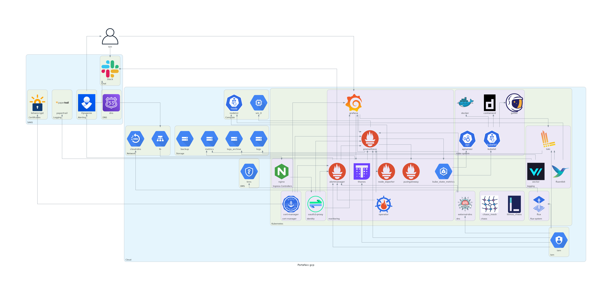
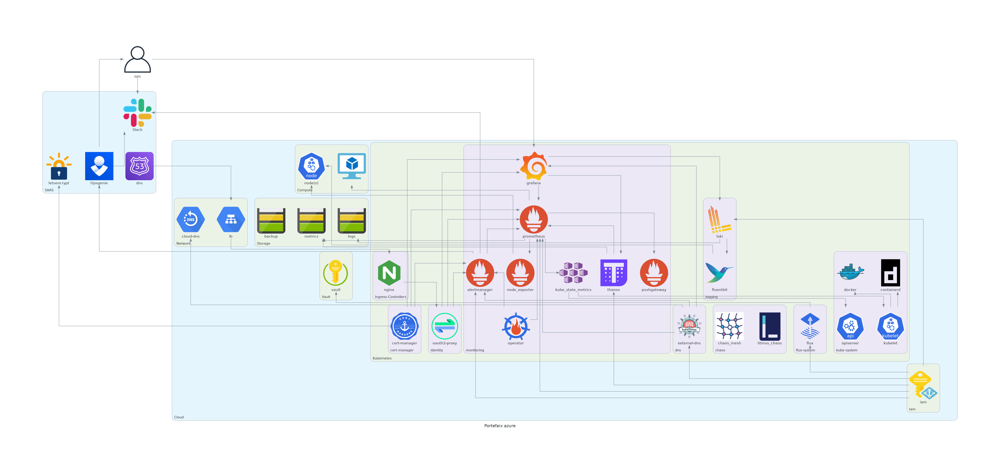

# Portefaix

`v0.0.0`

## Description

A Kubernetes experience ...

| Cloud Provider | Terraform | Kubernetes | Tfscan | Inspec |
|-----|:-----:|:-----:|:-----:|:-----:|
| Google Cloud Platform | :material-check: | :material-check: | :material-check: | :material-check: |
| Amazon AWS | :material-check: | :material-check: | :material-check: | :material-check: |
| Microsoft Azure | :material-check: | :material-check: | :material-check: | :material-check: |
| Scaleway | :material-check: | :material-check: | :material-close: | :material-close: |
| Digital Ocean | :material-check: | :material-check: | :material-close: | :material-close: | :material-close: |

## Architecture

=== "Google Cloud Platform"

    

=== "Amazon AWS"

    

=== "Microsoft Azure"

    