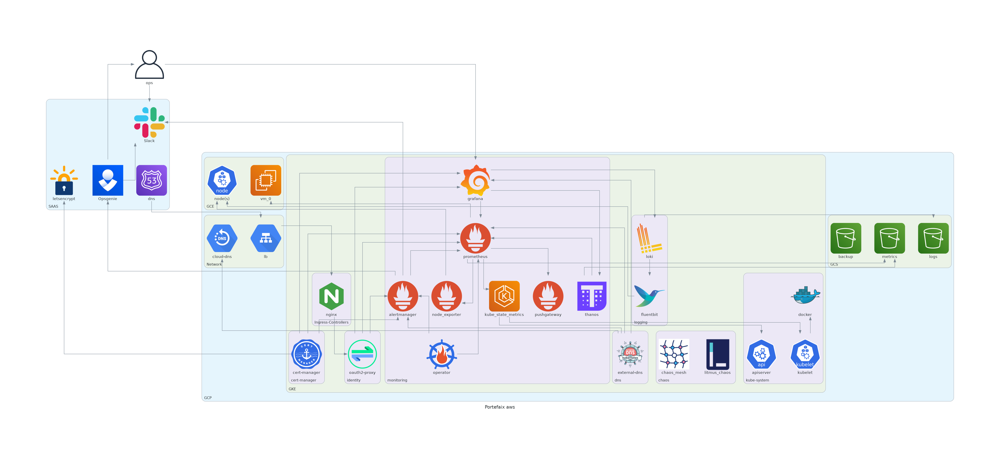

# Amazon AWS

!!! info
    Work In Progress



## Setup

Create an [admin user](https://docs.aws.amazon.com/IAM/latest/UserGuide/getting-started_create-admin-group.html).
Then [API Keys](https://console.aws.amazon.com/iam/home?#/security_credentials),
and configure Portefaix environment file `${HOME}/.config/portefaix/portefaix.sh`:

```shell
# AWS
export AWS_ACCESS_KEY_ID="....."
export AWS_SECRET_ACCESS_KEY="....."
export AWS_DEFAULT_REGION="..."
export AWS_REGION="...."
```

And load environment :

```shell
❯ . ./portefaix.sh aws
```

## Storage for Terraform

Create a S3 bucket for Terraform states:

```shell
❯ make -f hack/aws.mk aws-s3-bucket ENV=staging
```

Create a DynamoDB table :

```shell
❯ make -f hack/aws.mk aws-dynamodb-create-table ENV=staging
```

## Terraform


Infrastructure As Code for Portefaix using Amazon AWS is in
`iac/aws` directory

!!! caution "Prerequisites"
    A project created on Amazon AWS

    Edit `iac/aws/aws.staging.mk` or add another file named :
    `iac/aws/aws.<ENVIRONMENT>.mk`

### VPC / Internet Gateway

Create an Elastic IP for Internet Gateway:

```shell
❯ make terraform-apply SERVICE=iac/aws/elastic_ips/internet-gateway ENV=staging
```

Create the VPC and Internet Gateway :

```shell
❯ make terraform-apply SERVICE=iac/aws/vpc ENV=staging
```

### EKS

```shell
❯ make terraform-apply SERVICE=iac/aws/eks ENV=staging
```

### Kubernetes components

#### Sops

```shell
❯ make terraform-apply SERVICE=iac/aws/sops ENV=staging

Outputs:                                                                                                                                                
kms_arn = arn:aws:kms:eu-west-3:447241706233:key/cf77f24a-00db-4d6a-8b4b-a8dec3976ff2                     
role_arn_eks = arn:aws:iam::447241706233:role/portefaix-staging-eks-sops-eks                              
role_arn_users = arn:aws:iam::447241706233:role/portefaix-staging-eks-sops-users         
```

#### Observability

```shell
❯ make terraform-apply SERVICE=iac/aws/observability ENV=staging

Outputs:

loki_role_arn = arn:aws:iam::xxxxxxxxxxxxx:role/portefaix-staging-eks-loki
prometheus_role_arn = arn:aws:iam::xxxxxxxxxxxxx:role/portefaix-staging-eks-loki
tempo_role_arn = arn:aws:iam::xxxxxxxxxxxxx:role/portefaix-staging-eks-tempo
thanos_role_arn = arn:aws:iam::xxxxxxxxxxxxx:role/portefaix-staging-eks-thanos
```

#### External DNS

```shell
❯ make terraform-apply SERVICE=iac/aws/external-dns ENV=staging

Outputs:

role_arn = arn:aws:iam::xxxxxxxxxxx:role/portefaix-staging-eks-external-dns
```

#### Velero

```shell
❯ make terraform-apply SERVICE=iac/aws/velero ENV=staging

Outputs:

role_arn = arn:aws:iam::xxxxxxxxxxxxxxxxx:role/portefaix-staging-eks-velero
```

#### Vector

```shell
❯ make terraform-apply SERVICE=iac/aws/vector ENV=staging

Outputs:

role_arn = arn:aws:iam::xxxxxxxxxxxxxxxxx:role/portefaix-staging-eks-vector
```

#### Cert-Manager

```shell
❯ make terraform-apply SERVICE=iac/aws/cert-manager ENV=staging

Outputs:

role_arn = arn:aws:iam::xxxxxxxxxxxxxxxxx:role/portefaix-staging-eks-cert-manager
```

## Access

Configure kubectl

```shell
❯ make kubernetes-credentials CLOUD=aws ENV=staging
```

```shell
❯ kubectl get nodes
NAME                                        STATUS   ROLES    AGE    VERSION
ip-10-0-31-216.eu-west-3.compute.internal   Ready    <none>   101m   v1.18.9-eks-d1db3c
ip-10-0-40-203.eu-west-3.compute.internal   Ready    <none>   101m   v1.18.9-eks-d1db3c
```

## Inspec

[inspec](http://inspec.io/) is used to check infrastructure.

Check:

```shell
❯ make -f hack/aws.mk inspec-debug
Test infrastructure

 ────────────────────────────── Platform Details ──────────────────────────────

Name:      aws
Families:  cloud, api
Release:   train-aws: v0.1.15, aws-sdk-core: v3.94.0
```

Execute tests:

```shell
❯ make -f hack/aws.mk inspec-test SERVICE=iac/aws/<SERVICE> ENV=staging
```

You could upload JSON results file to [Heimdall Lite](https://heimdall-lite.mitre.org/) to display ressults

### CIS AWS Foundations Benchmark

You could perform tests according to the [CIS AWS Foundations Benchmark](https://docs.aws.amazon.com/securityhub/latest/userguide/securityhub-standards-cis.html):

```shell
❯ make -f hack/aws.mk inspec-aws-cis ENV=staging
```

### CIS Kubernetes Benchmark

```shell
❯ make -f hack/aws.mk inspec-aws-kubernetes ENV=staging
```

### AWS-VPC

```shell
❯ make -f hack/aws.mk inspec-test SERVICE=iac/aws/vpc ENV=staging
```


| Code | Description|
|---|---|
| `vpc-1` | Ensure that VPC exist and tags correcly set |
| `vpc-2` | Ensure that VPC have an Internet Gateway |
| `vpc-3` | Check AWS Security Groups does not have undesirable rules | 
| `vpc-4` | Ensure that VPC Subnets exists |

### AWS-EKS

```shell
❯ make -f hack/aws.mk inspec-test SERVICE=iac/aws/eks ENV=staging
```


| Code | Description|
|---|---|
| `eks-1` | Ensure the AWS EKS Cluster is running a minimal version |
| `eks-2` | Ensure the AWS EKS Cluster control plane has audit logs enabled |
| `eks-3` | Ensure the AWS EKS Cluster is not public |
| `eks-4` | Ensure the AWS EKS Cluster has application secrets encryption enabled |
| `eks-5` | Ensure AWS EKS Cluster Subnets are specific |
| `eks-6` | Ensure AWS EKS Cluster Nodegroups do not allow remote access from all IPs 

### AWS-Sops

```shell
❯ make -f hack/aws.mk inspec-test SERVICE=iac/aws/sops ENV=staging
```


| Code | Description|
|---|---|
| `sops-1` | Ensure that Kms key exist |
| `sops-1` | Ensure IAM roles and policies exists |

### AWS-Observability

```shell
❯ make -f hack/aws.mk inspec-test SERVICE=iac/aws/observability ENV=staging
```


| Code | Description|
|---|---|
| `prometheus-1` | Ensure IAM roles and policies exists |
| `thanos-1` | Ensure that S3 bucket exist and tags correcly set |
| `thanos-2` | Ensure that S3 log bucket exist and tags correcly set |
| `thanos-3` | Ensure that Kms key exist |
| `thanos-4` | Ensure IAM roles and policies exists |
| `loki-1` | Ensure that S3 bucket exist and tags correcly set |
| `loki-2` | Ensure that S3 log bucket exist and tags correcly set |
| `loki-3` | Ensure that Kms key exist |
| `loki-4` | Ensure IAM roles and policies exists |
| `tempo-1` | Ensure that S3 bucket exist and tags correcly set |
| `tempo-2` | Ensure that S3 log bucket exist and tags correcly set |
| `tempo-3` | Ensure that Kms key exist |
| `tempo-4` | Ensure IAM roles and policies exists |

### AWS-Velero

```shell
❯ make -f hack/aws.mk inspec-test SERVICE=iac/aws/velero ENV=staging
```


| Code | Description|
|---|---|
| `velero-1` | Ensure that S3 bucket exist and tags correcly set |
| `velero-2` | Ensure that S3 log bucket exist and tags correcly set |
| `velero-3` | Ensure that Kms key exist |
| `velero-4` | Ensure IAM roles and policies exists |

### AWS-Vector

```shell
❯ make -f hack/aws.mk inspec-test SERVICE=iac/aws/vector ENV=staging  
```


| Code | Description|
|---|---|
| `vector-1` | Ensure that S3 bucket exist and tags correcly set |
| `vector-2` | Ensure that S3 log bucket exist and tags correcly set |
| `vector-3` | Ensure that Kms key exist |
| `vector-4` | Ensure IAM roles and policies exists |
