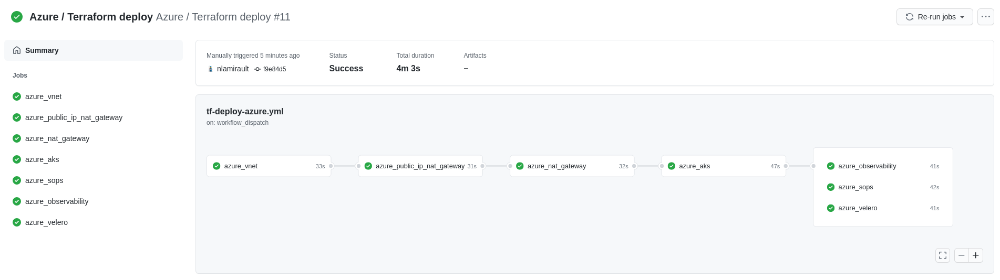

# Azure

!!! info
    Work In Progress


## Setup

Export Azure credentials:

```shell
❯ export AZURE_SUBSCRIPTION_ID="xxxxxx"
```

## Storage for Terraform

Create a [Storage Account](https://portal.azure.com/#create/Microsoft.StorageAccount) :

```shell
❯ make -f hack/azure.mk azure-storage-account ENV=dev
XXXXXXXXXXX
```

You could see the Key on the output.

Create storage container for Terraform states:

```shell
❯ make -f hack/azure.mk azure-storage-container ENV=dev KEY="xxxxxxxxxxxxxxxxx"
```

Create the Service Principal for Terraform:

```shell
❯ make -f hack/azure.mk azure-sp ENV=dev
{
  "appId": "xxxxxxxxxxxxxxxxx",
  "displayName": "portefaix-dev",
  "name": "http://portefaix-dev",
  "password": "xxxxxxxxxxxx",
  "tenant": "xxxxxxxxxxxx"
}
```

Extract informations and configure portefaix configuration file (`hack/config/portefaix.sh`):

* `SUBSCRIPTION_ID`
* `CLIENT_ID`
* `CLIENT_SECRET`
* `ARM_TENANT_ID`

And load environment :

```shell
❯ . ./portefaix.sh azure
```

Set permissions:

```shell
❯ make -f hack/azure.mk azure-permissions ENV=dev
```

## Terraform


Infrastructure As Code for Portefaix using Azure is in
`iac/azure` directory

!!! caution "Prerequisites"
    A project created on Azure

    Edit `iac/azure/azure.dev.mk` or add another file named :
    `iac/azure/azure.<ENVIRONMENT>.mk`

### Virtual Network

```shell
❯ make terraform-apply SERVICE=iac/azure/vnet ENV=dev
```

### NAT Gateway

Public IP addresses :

```shell
❯ make terraform-apply SERVICE=iac/azure/public-ips/nat-gateway ENV=dev
```

NAT Gateway service:

```shell
❯ make terraform-apply SERVICE=iac/azure/nat-gateway ENV=dev
```

### AKS

```shell
❯ make terraform-apply SERVICE=iac/azure/aks ENV=dev
```

### Kubernetes components

#### Sops

```shell
❯ make terraform-apply SERVICE=iac/azure/sops ENV=dev
```

#### Observability

```shell
❯ make terraform-apply SERVICE=iac/azure/observability ENV=dev
```

#### Velero

```shell
❯ make terraform-apply SERVICE=iac/azure/velero ENV=dev
```

## Inspec

[inspec](http://inspec.io/) is used to check infrastructure.

Check:

```shell
❯ make -f hack/azure.mk inspec-debug
Test infrastructure

 ────────────────────────────── Platform Details ──────────────────────────────

Name:      azure
Families:  cloud, api
Release:   azure_mgmt_resources-v0.17.8
```

Execute tests:

```shell
❯ make -f hack/azure.mk inspec-test SERVICE=iac/azure/<SERVICE> ENV=dev
```

You could upload JSON results file to [Heimdall Lite](https://heimdall-lite.mitre.org/) to display ressults

### Microsoft Azure CIS Foundations

You could perform tests accoring the [CIS Microsoft Azure Foundations Security Benchmark](https://azure.microsoft.com/fr-fr/resources/cis-microsoft-azure-foundations-security-benchmark/):

```shell
❯ make -f hack/azure.mk inspec-cis ENV=dev
```

### Inspec-AKS


| Code | Description|
|---|---|
| `resourcegroup-1` | Check that resource group exists |
| `aks-1` | Ensure logging to Azure Monitor is configured |
| `aks-2` | Ensure RBAC is enabled |
| `aks-3` | Ensure API Server Authorized IP Ranges are configured |

## Github Actions

Infrasture deployment could be launch using a manual trigger :




## Access

Configure kubectl

```shell
❯ make kubernetes-credentials CLOUD=azure ENV=dev
```

```shell
❯ kubectl get nodes
NAME                           STATUS   ROLES   AGE     VERSION
aks-core-19506595-vmss000000   Ready    agent   4m10s   v1.18.8
aks-core-19506595-vmss000001   Ready    agent   4m12s   v1.18.8
```