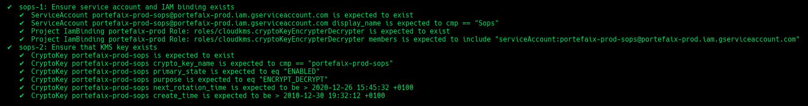
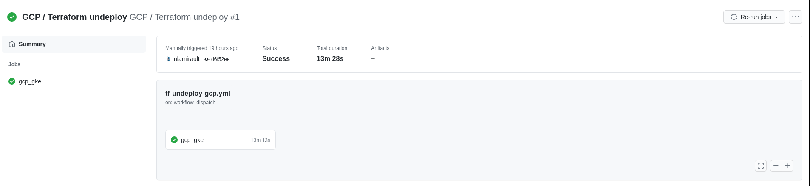

# Google Cloud Platform

!!! info
    Work In Progress


## Setup

Authenticate on the Google Cloud Platform:

```shell
❯ gcloud auth application-default login
```

Enable APIs:

```shell
❯ make -f hack/gcp.mk gcp-enable-apis ENV=prod
```

Create a bucket for the Terraform tfstates:

```shell
❯ make -f hack/gcp.mk gcp-bucket ENV=prod
```

Configure Portefaix environment file `${HOME}/.config/portefaix/portefaix.sh`:

```shell
# GCP
export TF_VAR_master_authorized_networks='[{"cidr_block": "x.x.x.x/32", "display_name": "Home"}]'
```

And load environment :

```shell
❯ . ./portefaix.sh gcp
```

## Terraform


Infrastructure As Code for Portefaix on Google Cloud Platform is in
`iac/gcp` directory

!!! caution "Prerequisites"
    A project created on Google Cloud Platform.

    Edit `iac/gcp/gcp.prod.mk` or add another file named :
    `iac/gcp/gcp.<ENVIRONMENT>.mk`

| Applications | Versions | Description|
|---|:--:|---|
| Terraform | `v0.13.5` | Usage of [tfenv](https://github.com/tfutils/tfenv) is recommanded |
| GKE | `v1.18.X` | Rapid Channel |

### VPC

```shell
❯ make terraform-apply SERVICE=iac/gcp/vpc ENV=prod
```

### Cloud DNS

```shell
❯ make terraform-apply SERVICE=iac/gcp/dns ENV=prod
```

### Cloud NAT

```shell
❯ make terraform-apply SERVICE=iac/gcp/external-ips/cloud-nat ENV=prod
```

```shell
❯ make terraform-apply SERVICE=iac/gcp/cloud-nat ENV=prod
```

### GKE

```shell
❯ make terraform-apply SERVICE=iac/gcp/gke ENV=prod
```

### Kubernetes components

#### Sops

```shell
❯ make terraform-apply SERVICE=iac/gcp/sops ENV=prod

Outputs:

email = xxxxxxxxxxxx-sops@xxxxxxxxxxxx.iam.gserviceaccount.com
key = projects/xxxxxxxxxxxx/locations/europe-west1/keyRings/xxxxxxxxxxxx-sops/cryptoKeys/xxxxxxxxxxxx-sops
```

#### Observability

```shell
❯ make terraform-apply SERVICE=iac/gcp/observability ENV=prod

Outputs:

loki_service_account = xxxxxxxxxx-loki@xxxxxxxxxx.iam.gserviceaccount.com
prometheus_service_account = xxxxxxxxxx-loki@xxxxxxxxxx.iam.gserviceaccount.com
tempo_service_account = xxxxxxxxxx-tempo@xxxxxxxxxx.iam.gserviceaccount.com
thanos_service_account = xxxxxxxxxx-thanos@xxxxxxxxxx.iam.gserviceaccount.com
```

#### Cert Manager

```shell
❯ make terraform-apply SERVICE=iac/gcp/cert-manager ENV=prod

Outputs:

cert_manager_service_account = xxxxxxxxxxx-cert-manager@xxxxxxxxxxx.iam.gserviceaccount.com
```

#### External DNS

```shell
❯ make terraform-apply SERVICE=iac/gcp/external-dns ENV=prod

Outputs:

external_dns_service_account = xxxxxxxxxxx-external-dns@xxxxxxxxxxx.iam.gserviceaccount.com
```

#### Velero

```shell
❯ make terraform-apply SERVICE=iac/gcp/velero ENV=prod

Outputs:

velero_service_account = xxxxxxxxxxx-velero@xxxxxxxxxxx.iam.gserviceaccount.com
```

#### Vector

```shell
❯ make terraform-apply SERVICE=iac/gcp/vector ENV=prod

Outputs:

vector_service_account = xxxxxxxxxxx-vector@xxxxxxxxxxx.iam.gserviceaccount.com
```

## Inspec

[inspec](http://inspec.io/) is used to check infrastructure :

Check:

```shell
❯ make -f hack/gcp.mk inspec-debug
Test infrastructure

 ────────────────────────────── Platform Details ──────────────────────────────

Name:      gcp
Families:  cloud, api
Release:   google-api-client-v0.34.1
```

Execute tests:

```shell
❯ make -f hack/gcp.mk inspec-test SERVICE=iac/gcp/<SERVICE> ENV=prod
```

You could upload JSON results file to [Heimdall Lite](https://heimdall-lite.mitre.org/) to display ressults

### CIS Kubernetes Benchmark

```shell
❯ make -f hack/gcp.mk inspec-gcp-kubernetes ENV=prod
```

### GCP CIS

You could perform tests accoring the [GCP CIS](https://opensource.googleblog.com/2020/08/assess-security-of-cloud-deployments.html):

```shell
❯ make -f hack/gcp.mk inspec-cis ENV=prod
```

### GCP-VPC

```shell
❯ make -f hack/gcp.mk inspec-test SERVICE=iac/gcp/vpc ENV=prod
```


| Code | Description|
|---|---|
| `vpc-1` | Ensure default network is deleted |
| `vpc-2` | Ensure network is correctly configure |

### GCP-GKE

```shell
❯ make -f gcp.mk inspec-test SERVICE=iac/gcp/gke ENV=prod
```


| Code | Description|
|---|---|
| `gke-1` | Stackdriver Logging and Monitoring is configured |
| `gke-2` | Basic Authentication is disabled |
| `gke-3` | Ensure GKE Nodes are not public |
| `gke-4` | Ensure the GKE Control Plane is not public |
| `gke-5` | Ensure the Network Policy managed addon is enabled |
| `gke-6` | Ensure OAuth Access Scopes and dedicated Service Accounts for node pools |
| `gke-7` | Ensure GKE Node Pools should use the COS or COS_CONTAINERD Operating System |
| `gke-8` | GKE Workload Identity should be enabled on all node pools |
| `gke-9` | GKE Shielded Nodes should be enabled on all NodePools |
| `gke-10` | Ensure instances have labels |
| `gke-11` | Ensure instances have tags |

### GCP-Sops

```shell
❯ make -f hack/gcp.mk inspec-test SERVICE=iac/gcp/sops ENV=prod
```



| Code | Description|
|---|---|
| `sops-1` | Ensure service account and IAM binding exists |
| `sops-2` | Ensure that Kms key exist |

### GCP-Observability

```shell
❯ make -f hack/gcp.mk inspec-test SERVICE=iac/gcp/observability ENV=prod
```


| Code | Description|
|---|---|
| `grafana-1` | Ensure service account and IAM binding exists |
| `prometheus-1` | Ensure service account and IAM binding exists |
| `thanos-1` | Ensure service account and IAM binding exists |
| `thanos-2` | Ensure that bucket exists and labels correcly set |
| `thanos-3` | Ensure that Kms key exist |
| `loki-1` | Ensure service account and IAM binding exists |
| `loki-2` | Ensure that bucket exists and labels correcly set |
| `loki-3` | Ensure that Kms key exist |
| `tempo-1` | Ensure service account and IAM binding exists |
| `tempo-2` | Ensure that bucket exists and labels correcly set |
| `tempo-3` | Ensure that Kms key exist |

### GCP-Velero

```shell
❯ make -f hack/gcp.mk inspec-test SERVICE=iac/gcp/velero ENV=prod
```


| Code | Description|
|---|---|
| `velero-1` | Ensure service account and IAM binding exists |
| `velero-2` | Ensure that bucket exists and labels correcly set |
| `velero-3` | Ensure that Kms key exist |

### GCP-Vector

```shell
❯ make -f hack/gcp.mk inspec-test SERVICE=iac/gcp/vector ENV=prod
```


| Code | Description|
|---|---|
| `vector-1` | Ensure service account and IAM binding exists |
| `vector-2` | Ensure that bucket exists and labels correcly set |
| `vector-3` | Ensure that Kms key exist |

### GCP-External-DNS

```shell
❯ make -f hack/gcp.mk inspec-test SERVICE=iac/gcp/external-dns ENV=prod
```


| Code | Description|
|---|---|
| `external_dns-1` | Ensure service account and IAM binding exists |

## Github Actions

### Create


### Destroy



### Test


## Access

Configure kubectl

```shell
❯ make kubernetes-credentials CLOUD=gcp ENV=prod
```

```shell
❯ kubectl get nodes
NAME                                                  STATUS   ROLES    AGE     VERSION
gke-xxxxxxxxxx-cluster-g-core-5d5d62be-tf15   Ready    <none>   7h37m   v1.18.10-gke.601
```