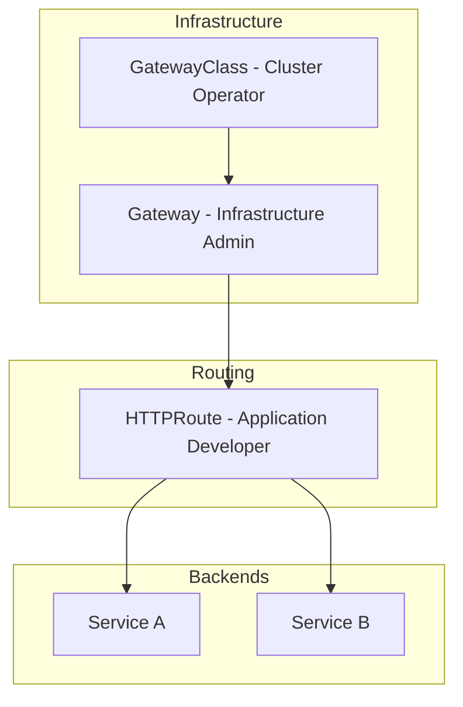

# RFC 013 - Gateway API Migration Strategy

## 1. 📝 Summary

This RFC proposes the migration from the legacy `Ingress` API to the modern **Kubernetes Gateway API**. This shift moves Portefaix towards a more expressive, role-oriented traffic management system that is cloud-native and standardized across providers.

## 2. 🎯 Motivation

### Current State
Portefaix uses the standard `Ingress` API, often via `nginx-ingress-controller`.

### Problems
- **Annotation Hell:** Advanced features (retries, header manipulation, canary) require provider-specific annotations.
- **Monolithic Configuration:** Infrastructure and application routing are mixed in a single resource.
- **Portability:** Moving between cloud providers often requires rewriting Ingress manifests.

## 3. 📖 Guide-level Explanation

The Gateway API introduces a decoupled model where different personas manage different resources:

## 4. 🔬 Reference-level Explanation

### Technical Requirements
- Native support for `GatewayClass`, `Gateway`, and `HTTPRoute` resources.
- Conformance with the latest Gateway API specifications (v1.1.0+).
- Support for both managed (AWS, GCP, Azure) and non-managed (Homelab) environments.
- Ability to coexist with existing Ingress resources during the transition.

## 5. 🔍 Considered Options

### Option 1: Traefik
- **Pros:** Mature, supports both Ingress and Gateway API simultaneously, excellent for transitions.
- **Cons:** Custom CRDs can be redundant with Gateway API.

### Option 2: Cilium
- **Pros:** High performance (eBPF), unified with our CNI.
- **Cons:** Requires enabling Cilium Service Mesh.

### Option 3: Envoy Gateway
- **Pros:** Built on the industry-standard Envoy proxy.
- **Cons:** Newer implementation, lacks simultaneous Ingress support.

## 6. Decision Outcome
**Traefik** is selected for non-managed environments to ease the migration by supporting both APIs in a single controller.

## 7. 🚀 Next Steps
1. Deploy Traefik with Gateway API enabled.
2. Pilot one core service migration to `HTTPRoute`.
3. Deprecate `nginx-ingress-controller` in favor of Traefik.
