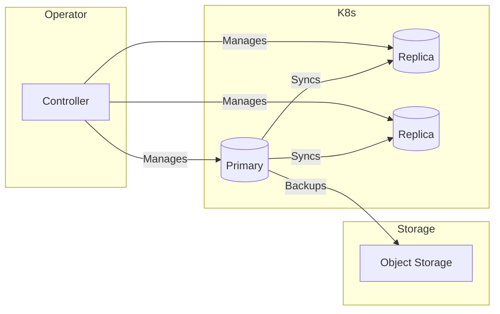

# RFC 014 - Cloud-Native Database Strategy

## 1. 📝 Summary

This RFC proposes a standardized approach for managing relational databases on Kubernetes using the **Operator pattern**. The goal is to automate Day-2 operations (backups, failover, scaling, patching) across our multi-cloud and homelab environments.

## 2. 🎯 Motivation

### Current State
Databases in Portefaix are either managed by cloud providers (RDS, Cloud SQL) or run manually in Kubernetes with limited automation for backups and high availability.

### Problems
- **Operational Complexity:** Manual management of HA clusters is difficult and error-prone.
- **Inconsistency:** Different setups for PostgreSQL, MySQL, and MariaDB.
- **Vendor Lock-in:** Cloud-managed databases are expensive and lock us into specific providers.
- **Disaster Recovery:** Need a unified, automated way to handle backups and point-in-time recovery (PITR).

## 3. 📖 Guide-level Explanation

We will use **Database Operators** to manage the full lifecycle of our databases.
The operator acts as a "digital DBA":
- **HA:** Automatically handles leader election and failover.
- **Backup:** Orchestrates backups to object storage (S3/MinIO).
- **Scale:** Simplifies adding or removing read replicas.

## 4. 🔬 Reference-level Explanation

### Technical Requirements
- Support for **Point-in-Time Recovery (PITR)**.
- Integration with external object storage for backups.
- Native Kubernetes observability (metrics, logging).
- Support for automated minor version upgrades.

## 5. 🔍 Considered Options

### PostgreSQL
- **CloudNativePG:** Built by EDB, natively designed for K8s, no external dependencies (like Patroni), extremely robust.
- **Zalando Postgres Operator:** Very mature, battle-tested at scale, but more complex configuration.

### MySQL
- **Moco:** MySQL Operator on Kubernetes by Cybozu. Focuses on simplicity and reliability using the standard MySQL replication.
- **Oracle MySQL Operator:** Official operator, feature-rich but heavily tied to Oracle's ecosystem.

### MariaDB
- **MariaDB Operator:** Community-driven, provides standard management for MariaDB clusters.

## 6. Decision Outcome
- **PostgreSQL:** CloudNativePG (for its modern architecture and simplicity).
- **MySQL:** Moco (for its reliability).
- **MariaDB:** MariaDB Operator.

## 7. 🚀 Next Steps
1. Deploy CloudNativePG and Moco operators.
2. Define standard `Backup` and `Storage` policies for all database instances.
3. Integrate with Prometheus for monitoring and alerting.
