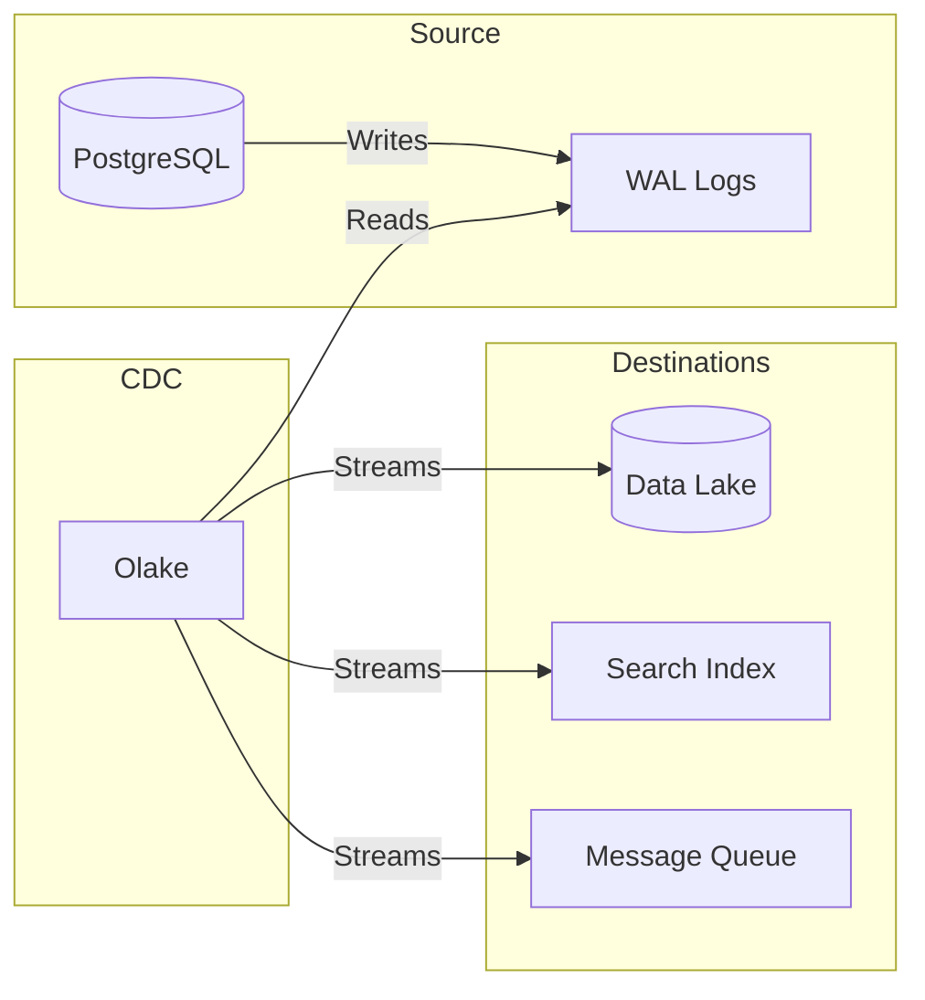

# RFC 016 - Change Data Capture (CDC) Strategy

## 1. 📝 Summary

This RFC proposes the implementation of a Change Data Capture (CDC) system for Portefaix. The goal is to capture real-time changes from our primary databases (PostgreSQL, MySQL) and stream them to downstream systems such as the Data Lakehouse (RFC 007), event-driven microservices, or search indexes.

## 2. 🎯 Motivation

### Current State

Data synchronization between our operational databases and analytical systems is currently handled by batch ETL processes or manual exports.

### Problems

- **Stale Data:** Analytical reports are only as fresh as the last batch run.
- **Source Load:** Large batch queries put significant stress on production databases.
- **Lack of Real-time Events:** We cannot easily trigger actions in one service based on a database change in another.
- **Inconsistency:** Complex logic is required to ensure no data is missed during batch windows.

## 3. 📖 Guide-level Explanation

Change Data Capture (CDC) allows us to "tail" the database transaction logs (like the WAL in PostgreSQL).

- **Non-Invasive:** It reads the logs without querying the tables directly, resulting in zero performance impact on the source.
- **Complete:** Every INSERT, UPDATE, and DELETE is captured as an event.
- **Real-time:** Changes are propagated in milliseconds.

## 4. 🔬 Reference-level Explanation

### Technical Requirements

- Support for **Log-Based CDC** to ensure efficiency.
- Native support for PostgreSQL (WAL/Logical Replication) and MySQL (Binlog).
- Low latency (sub-second) from source change to downstream availability.
- High scalability to handle growing transaction volumes.
- Cloud-native deployment (Kubernetes).

## 5. 🔍 Considered Options

### Option 1: Debezium

- **Pros:** Industry standard, extremely robust, wide database support.
- **Cons:** High operational complexity (requires Kafka/Kafka Connect), resource-intensive.

### Option 2: Airbyte

- **Pros:** Excellent UI, massive connector library.
- **Cons:** Performance can be an issue for very high-volume real-time streaming compared to specialized CDC tools.

### Option 3: Sequin

- **Pros:** Deep PostgreSQL integration, very easy to use.
- **Cons:** Limited to PostgreSQL; primarily a managed/SaaS-focused model.

### Option 4: Olake

- **Pros:** Modern, high-performance CDC engine, designed for real-time processing and scalability, user-friendly management.
- **Cons:** Newer than Debezium. Requires Temporal for orchestration and NFS for some storage components.

### Option 5: Apache Iggy

- **Pros:** High-performance message streaming platform written in Rust. Native support for CDC via the Iggy Connectors Runtime. Extremely low latency (microsecond-level) and high throughput using `io_uring`. Minimal resource footprint (single binary, no JVM).
- **Cons:** Currently in Apache Incubator; clustering is still maturing.

## 6. Decision Outcome

**Apache Iggy** is selected as the primary CDC and streaming engine. While Olake is a strong contender, its dependency on Temporal and NFS introduces additional operational complexity that we want to avoid in the Portefaix infrastructure. Apache Iggy's Rust-based architecture provides the required performance with a significantly smaller and more manageable footprint.

## 7. 🚀 Next Steps

1. Deploy Apache Iggy in the Portefaix infrastructure.
2. Configure the Iggy Connector for a pilot PostgreSQL database.
3. Stream changes to the Data Lakehouse (StarRocks).
