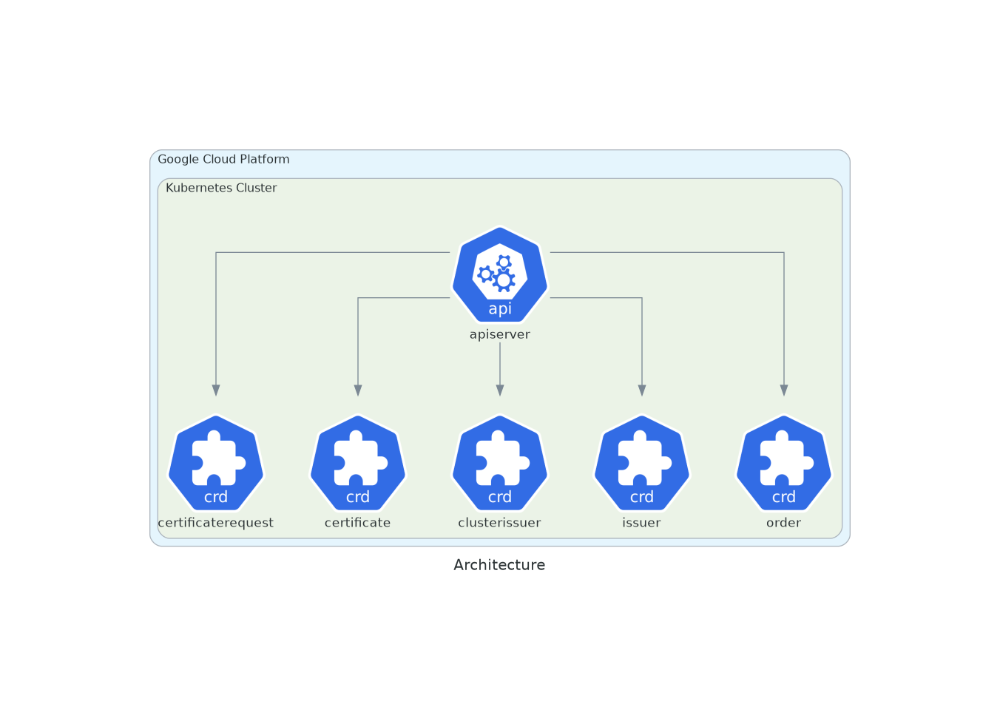
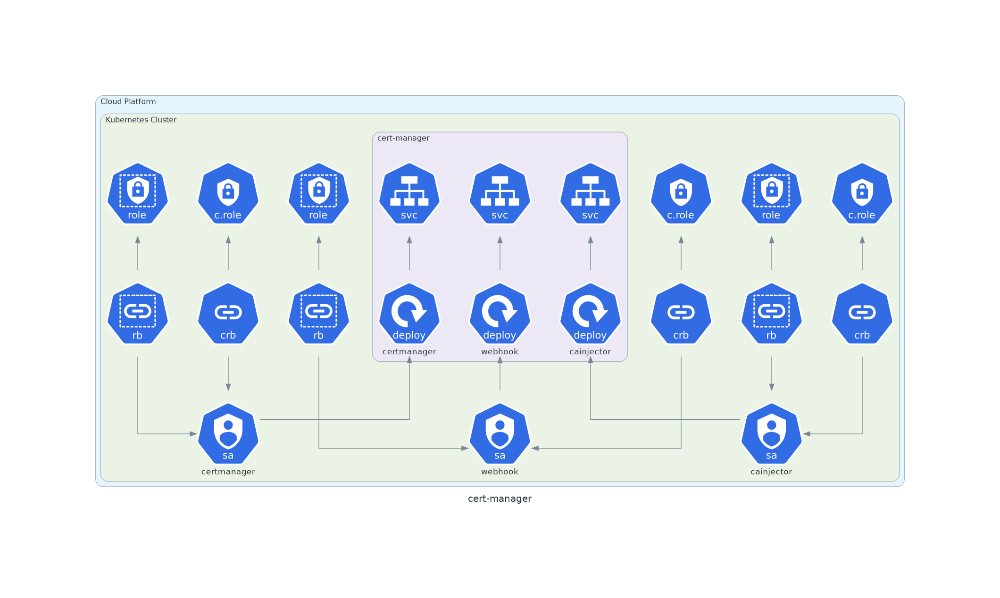

# Cert-Manager

Automatically provision and manage TLS certificates in Kubernetes

* Chart : [cert-manager](https://artifacthub.io/packages/helm/jetstack/cert-manager)
* Version: `1.0.4`

## Components

