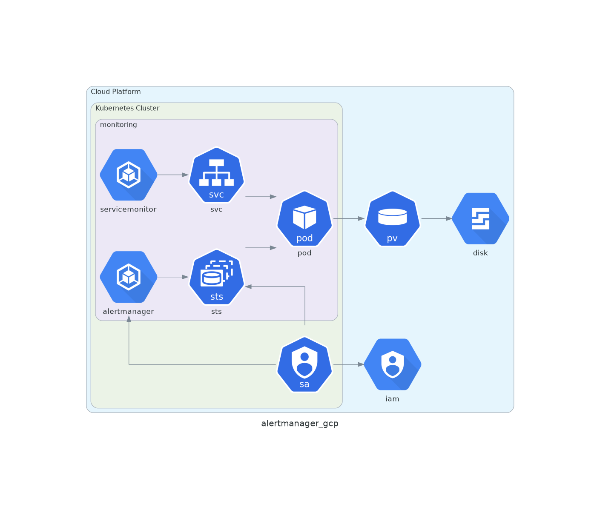
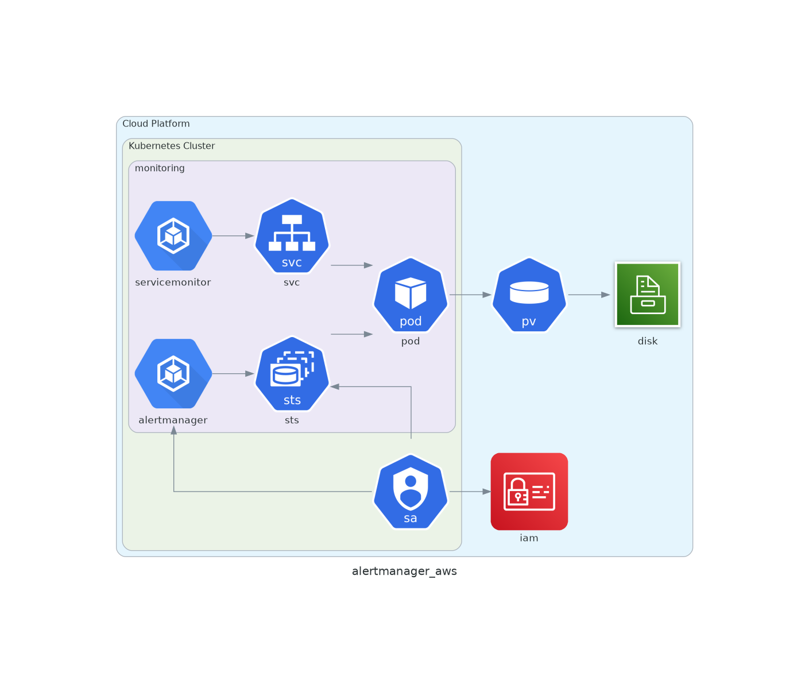
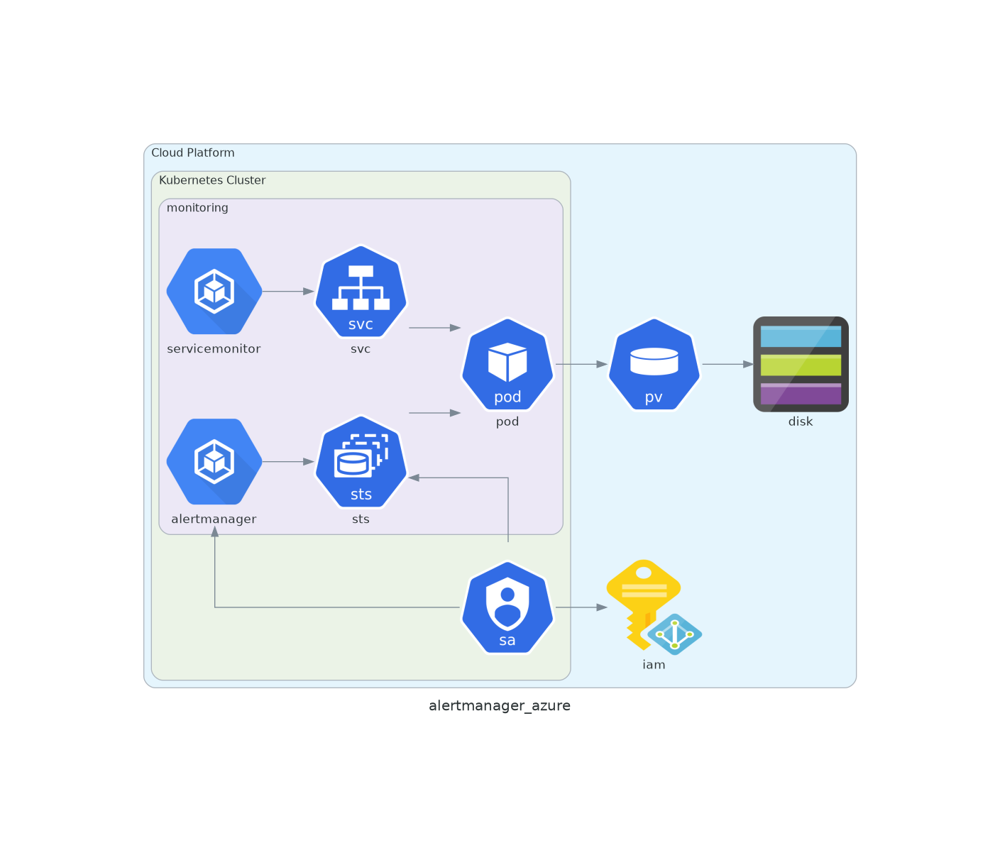

# Alertmanager

=== "Google Cloud Platform"

    

=== "Amazon AWS"

    

=== "Microsoft Azure"

    

## Description

* Chart : [kube-prometheus-stack](https://artifacthub.io/packages/helm/prometheus-community/kube-prometheus-stack)
* Version: `11.0.4`

## Checks

* Deployment of Alertmanager

```shell
❯ kubectl -n monitoring get alertmanager

```