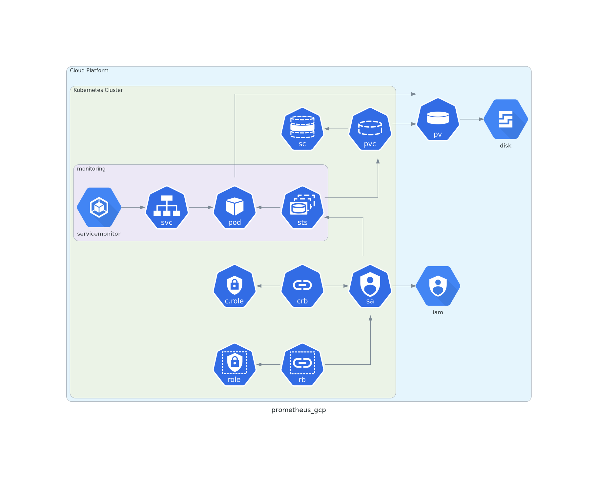
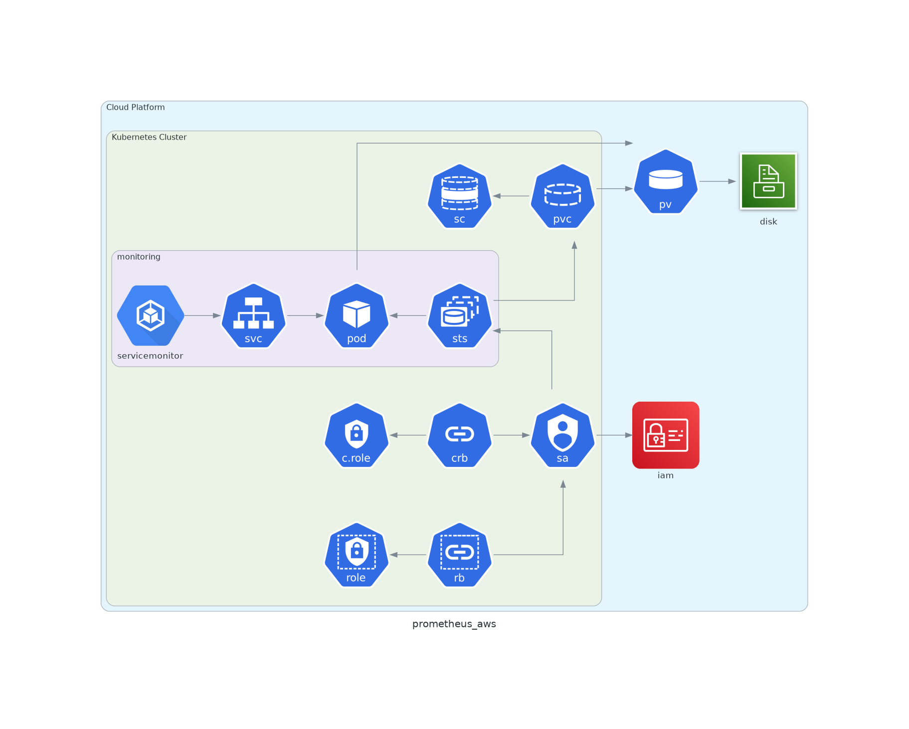

# Prometheus





## Description

* Chart : [kube-prometheus-stack](https://artifacthub.io/packages/helm/prometheus-community/kube-prometheus-stack)
* Version: `11.0.4`

## Checks

* Deployment of Prometheus

```shell
❯ kubectl -n monitoring get prometheus
NAME                               VERSION   REPLICAS   AGE
kube-prometheus-stack-prometheus   v2.22.1   1          41m

❯ kubectl get statefulsets.apps -n monitoring -l app=kube-prometheus-stack-prometheus
NAME                                          READY   AGE
prometheus-kube-prometheus-stack-prometheus   1/1     30m

❯ kubectl get svc -n monitoring -l app=kube-prometheus-stack-prometheus
NAME                               TYPE        CLUSTER-IP     EXTERNAL-IP   PORT(S)    AGE
kube-prometheus-stack-prometheus   ClusterIP   10.40.25.145   <none>        9090/TCP   29m

❯ kubectl get svc -n monitoring prometheus-operated
NAME                  TYPE        CLUSTER-IP   EXTERNAL-IP   PORT(S)              AGE
prometheus-operated   ClusterIP   None         <none>        9090/TCP,10901/TCP   29m
```
