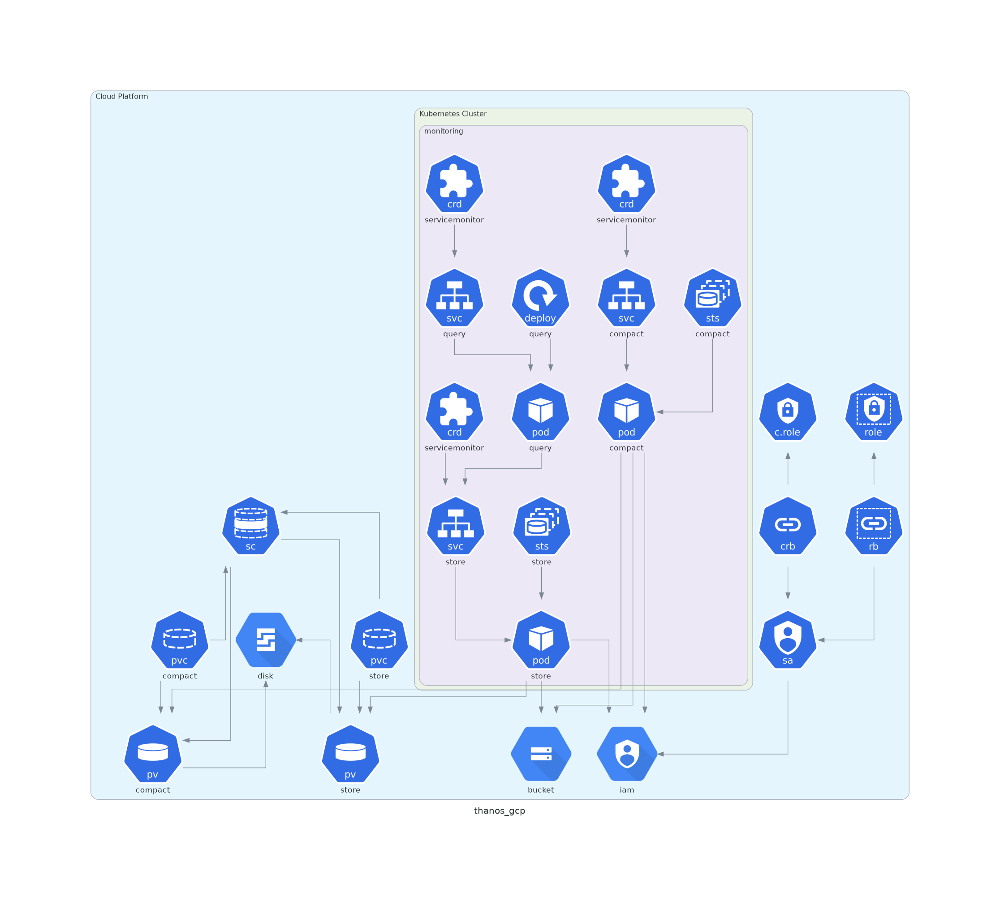
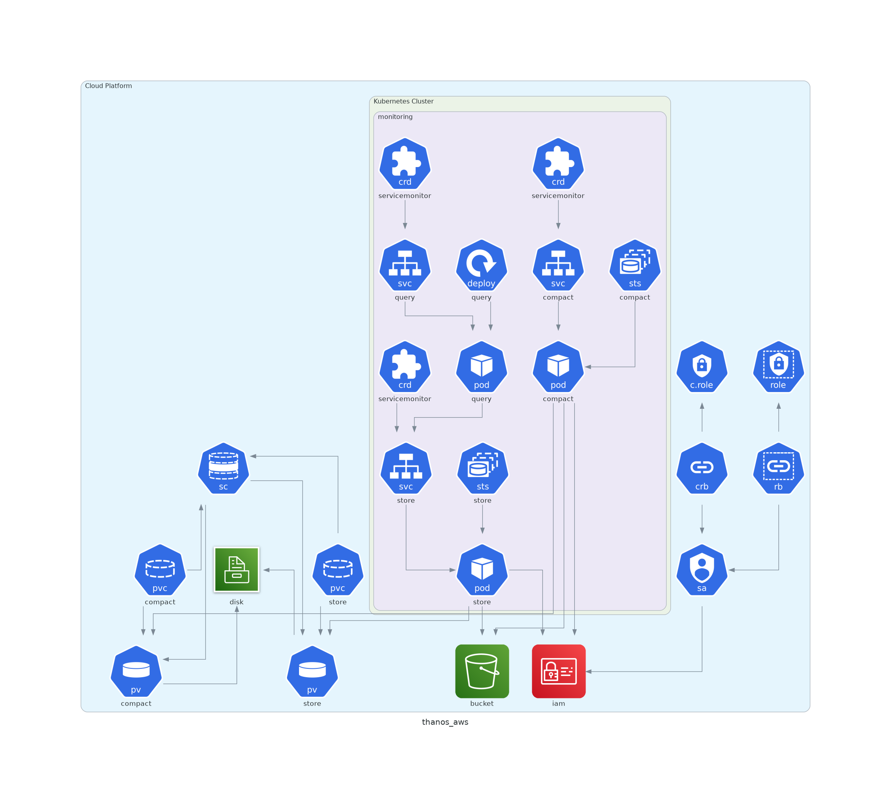
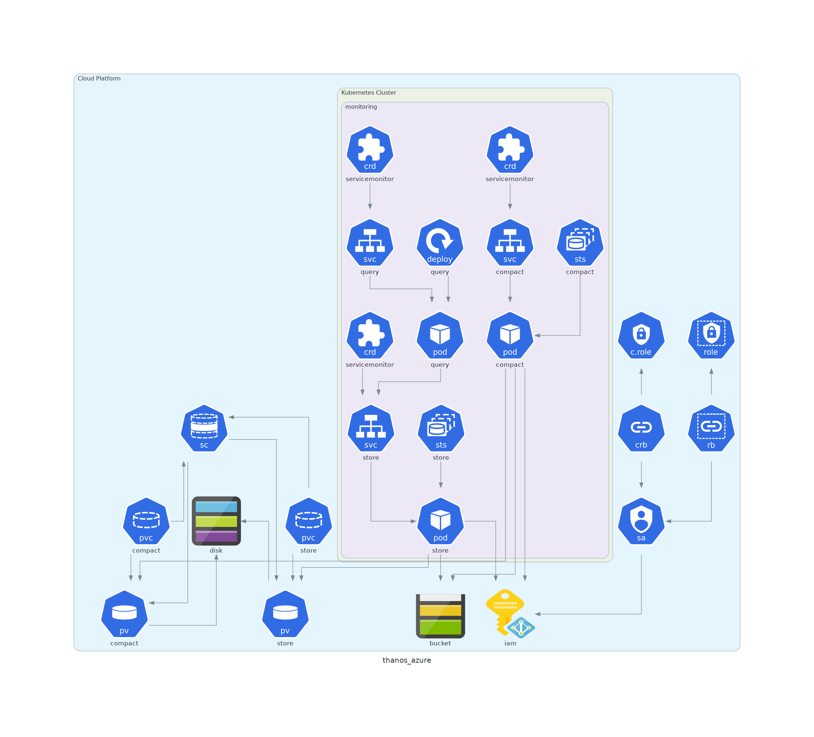

# Thanos

=== "Google Cloud Platform"

    

=== "Amazon AWS"

    

=== "Microsoft Azure"

    

## Description

* `WIP`: See [#46](https://github.com/nlamirault/portefaix/issues/46)
* Chart : [thanos](https://artifacthub.io/packages/helm/banzaicloud-stable/thanos)
* Version: `0.3.29`

## Checks

* Deployment of Thanos

```shell
```
