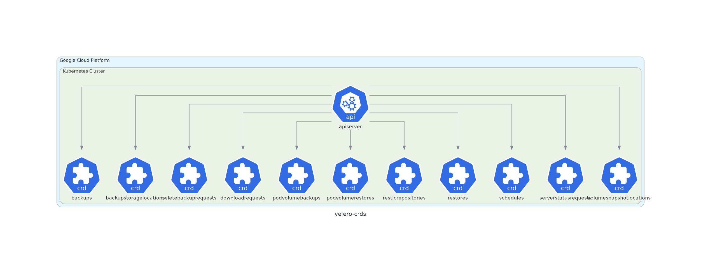

# Velero

For disaster recovery, Velero is used.

=== "Google Cloud Platform"

    

=== "Amazon AWS"

    

=== "Microsoft Azure"

    

## Description

* Chart : [velero](https://artifacthub.io/packages/helm/vmware-tanzu/velero)
* Version: `2.13.7`
